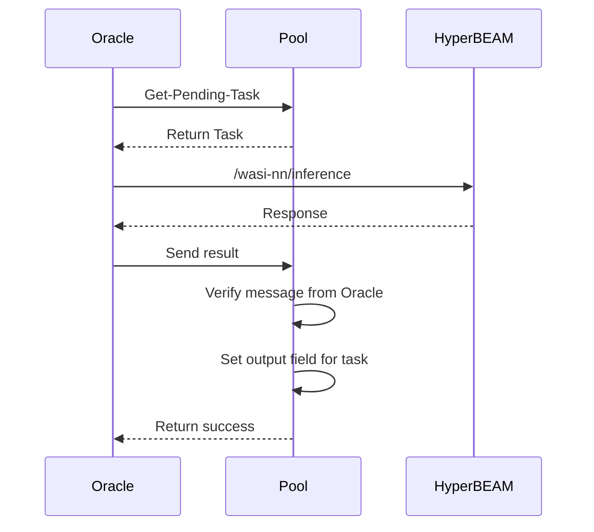

# ANPM Oracle

ANPM Oracle is a TypeScript implementation of a node that connects to the ANPM Pool process on Arweave and processes AI tasks using HyperBEAM.

## Overview

The ANPM Oracle node serves as a bridge between the AO smart contract Pool process and the HyperBEAM inference service. It polls for pending AI tasks from the Pool, processes them through HyperBEAM, and returns the results back to the Pool.

## Features

- Communicates with AO processes using @permaweb/aoconnect
- Processes AI inference tasks using HyperBEAM
- Automatic node ID generation and persistence
- Comprehensive logging with Winston and log rotation
- TypeScript support for better type safety and development experience

## Architecture



## Prerequisites

- Node.js v22 or higher
- Access to an AO Pool process ID
- HyperBEAM service endpoint
- Arweave wallet for signing transactions (if not using browser wallet)

## Installation

Clone the repository and install dependencies:

```bash
git clone https://github.com/your-username/ANPM-Oracle.git
cd ANPM-Oracle
npm install
```

## Configuration

Copy the example environment file:

```bash
cp .env.example .env
```

Edit the `.env` file to configure your Oracle:

```
# Pool process ID on Arweave (required)
POOL_PROCESS_ID=your_pool_process_id_here

# HyperBEAM API endpoint (required)
HYPERBEAM_URL=http://localhost:10000

# How often to poll for new tasks (in milliseconds)
POLL_INTERVAL=5000

# Oracle Node ID will be auto-generated on first run and saved here
# NODE_ID=
```

## Building

Build the project with TypeScript:

```bash
npm run build
```

## Running

Start the Oracle node:

```bash
npm start
```

For development with auto-restart:

```bash
npm run dev
```

## Logging

Logs are stored in the `logs` directory with daily rotation. Each log file follows the pattern `oracle-YYYY-MM-DD.log` and contains structured JSON logs. 

Log files are automatically rotated when they reach 20MB in size, and logs older than 14 days are automatically deleted.

## Project Structure

```
├── dist/               # Compiled JavaScript output
├── logs/               # Log files
├── src/
│   ├── index.ts        # Main Oracle implementation
│   └── utils/
│       ├── AOProcess.ts # AO communication class
│       └── logger.ts    # Winston logger configuration
├── .env                # Environment configuration
├── .env.example        # Example environment configuration
├── package.json        # Project metadata and dependencies
└── tsconfig.json       # TypeScript configuration
```

## Development

To extend or modify the Oracle:

1. The main logic is in `src/index.ts`
2. AO Process communication is handled by `src/utils/AOProcess.ts`
3. HyperBEAM inference is abstracted into the `runHyperBeamInference` function

## License

ISC

## Contributing

Contributions are welcome! Please feel free to submit a Pull Request.